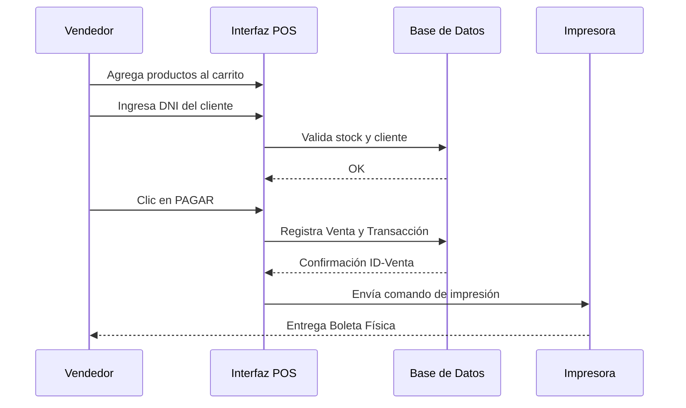
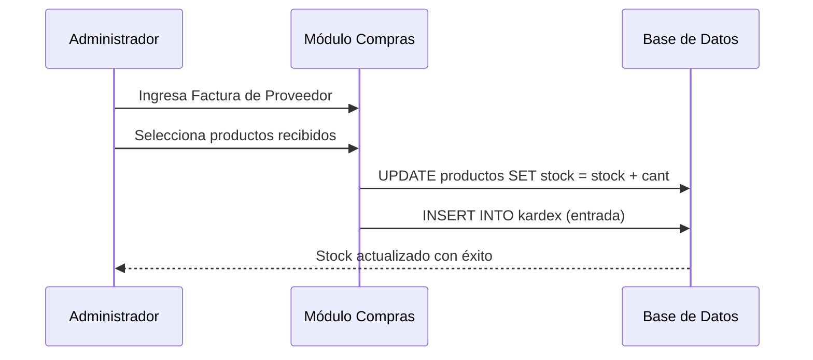
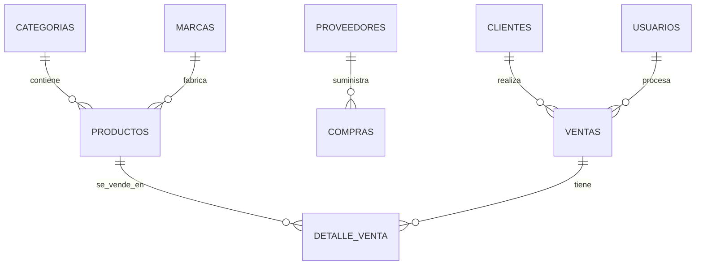
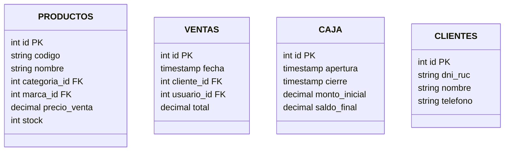

# DOCUMENTACIÓN TÉCNICA Y DIAGRAMAS - MOTOSTOCK PRO 2026

Este documento contiene los requerimientos funcionales y la estructura técnica del sistema **MotoStock Pro 2026** utilizando notación Mermaid para la generación automática de diagramas.

---

## 1. REQUERIMIENTOS FUNCIONALES

- **RF1: Gestión de Inventario**: Registro, edición y control de stock de repuestos con alertas de stock mínimo.
- **RF2: Punto de Venta (POS)**: Interfaz para ventas rápidas con carrito, búsqueda por DNI/RUC y generación de boletas.
- **RF3: Catálogo Virtual**: Tienda pública para clientes con filtros por categorías y marcas.
- **RF4: Control de Caja**: Apertura, cierre y registro de movimientos (ingresos/egresos).
- **RF5: Gestión de Usuarios**: Sistema de roles (Administrador y Cliente) con autenticación segura.
- **RF6: Gestión de Proveedores**: Directorio de proveedores originales, chinos y locales.

---

## 2. CASOS DE USO DEL SISTEMA (UML)

```mermaid
useCaseDiagram
    actor "Administrador" as Admin
    actor "Vendedor" as Vend
    actor "Cliente" as Cli

    package "MotoStock Pro 2026" {
        usecase "Control Total del Negocio" as UC1
        usecase "Gestión de Inventario" as UC2
        usecase "Reportes de Ventas" as UC3
        usecase "Apertura/Cierre de Caja" as UC4
        
        usecase "Proceso de Venta Mostrador" as UC5
        usecase "Buscar Cliente DNI" as UC6
        usecase "Emitir Boleta" as UC7
        
        usecase "Consultar Catálogo Virtual" as UC8
        usecase "Registro de Cuenta" as UC9
    }

    Admin --> UC1
    Admin --> UC2
    Admin --> UC3
    Admin --> UC4
    
    Vend --> UC5
    Vend --> UC6
    Vend --> UC7
    
    Cli --> UC8
    Cli --> UC9
```

---

## 3. DIAGRAMA DE ACTIVIDAD — FLUJO DE VENTA

```mermaid
activityDiagram
    start
    :Vendedor busca productos;
    :Agregar al Carrito;
    if (¿Cliente registrado?) then (Sí)
        :Autocompletar Datos;
    else (No)
        :Ingresar DNI/RUC Manual;
    endif
    :Ver Vista Previa Boleta;
    :Confirmar Pago;
    fork
        :Registrar Venta en BD;
        :Descontar Stock;
        :Generar Movimiento de Caja;
    end fork
    :Imprimir Ticket/Boleta;
    :Limpiar Carrito;
    stop
```

---

## 4. DIAGRAMA DE SECUENCIA

### 4.1 Registro de Venta en POS


### 4.2 Recepción de Mercadería (Actualización de Stock)


---

## 5. DIAGRAMAS DE BASE DE DATOS

### 5.1 Diagrama Entidad-Relación (ER)


### 5.2 Diagrama Físico de Base de Datos

